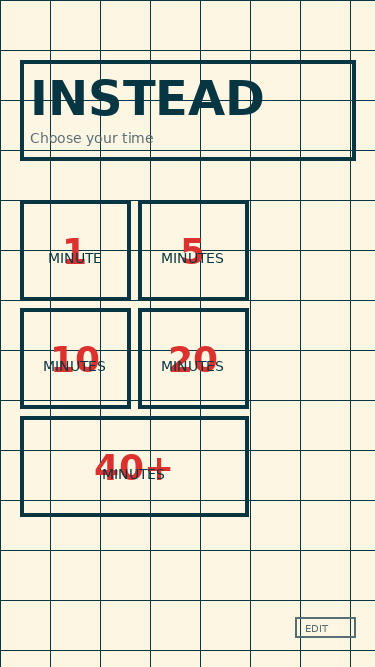
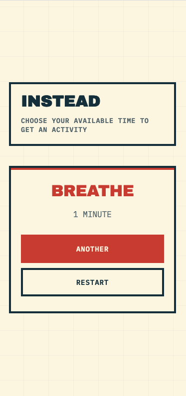
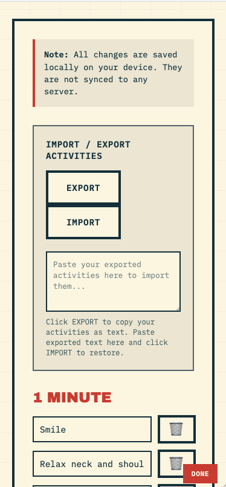

# Instead

A minimalist Progressive Web App (PWA) that helps you decide what to do based on how much time you have available.

## What It Does

Instead presents you with 5 time options (1, 5, 10, 20, or 40+ minutes) and randomly suggests an activity from a curated list appropriate for that time duration. The app works completely offline once installed and allows users to customize their activity lists.

### Screenshots

<p align="center">
  
  
  
</p>

**Left**: Choose your available time from 1 to 40+ minutes (or add custom durations)  
**Center**: Get a random activity suggestion with countdown timer and back arrow button  
**Right**: Edit mode with import/export, custom time categories, and activity management

### Key Features

- **Time-based activity selection**: Choose your available time and get a random activity suggestion
- **Countdown timer**: Built-in timer with visual countdown and completion sound notification
- **Fully offline**: Works without internet connection after first load
- **Customizable**: Edit, add, or delete activities in each time category
- **Dynamic time categories**: Add or remove custom time durations (e.g., 15, 30, 60 minutes)
- **Import/Export**: Save your activity lists as text to backup or transfer between devices
- **Progressive Web App**: Installable on mobile and desktop devices
- **Persistent storage**: Your custom activities and time categories are saved locally
- **Clean design**: Solarized Light color scheme with Swiss brutalist aesthetics

## Quick Start

1. Upload all files to a web server or static host (Netlify, Vercel, GitHub Pages, etc.)
2. Visit the URL in a browser
3. Optional: Install as an app by clicking "Add to Home Screen" (mobile) or the install icon (desktop)

### Required Files

```
index.html          - Main application file
manifest.json       - PWA configuration
service-worker.js   - Offline functionality
icon-192.png        - App icon (192×192)
icon-512.png        - App icon (512×512)
```

## Code Architecture

The app is built as a single-page application using vanilla JavaScript. No frameworks or build tools required.

### File Structure

```
├── index.html          # HTML structure, CSS styles, and JavaScript logic (all-in-one)
├── manifest.json       # PWA manifest defining app metadata and icons
├── service-worker.js   # Service worker for caching and offline support
├── icon-192.png        # Small app icon
└── icon-512.png        # Large app icon
```

### Architecture Overview

```
┌─────────────────────────────────────────────────────────────┐
│                        index.html                            │
│  ┌─────────────┐  ┌─────────────┐  ┌──────────────────┐   │
│  │   HTML      │  │     CSS     │  │   JavaScript     │   │
│  │  Structure  │  │   Styling   │  │  Logic & State   │   │
│  └─────────────┘  └─────────────┘  └──────────────────┘   │
└─────────────────────────────────────────────────────────────┘
                              │
                              │ references
                              ▼
                    ┌──────────────────┐
                    │  manifest.json   │
                    │  (PWA config)    │
                    └──────────────────┘
                              │
                              │ registers
                              ▼
                    ┌──────────────────┐
                    │ service-worker.js│
                    │ (Offline cache)  │
                    └──────────────────┘
```

## Main Components

### 1. HTML Structure (index.html)

The HTML contains three main screens that are toggled via JavaScript:

```html
<div class="screen active" id="timeScreen">
  <!-- 5 time selection buttons: 1, 5, 10, 20, 40+ minutes -->
</div>

<div class="screen" id="resultScreen">
  <!-- Shows the selected activity with:
       - Countdown timer display (MM:SS format)
       - START TIMER and RESET buttons
       - ANOTHER button (hidden while timer is running)
       - Back arrow (←) at bottom-left
  -->
</div>

<div class="screen" id="editScreen">
  <!-- Edit mode: 
       - Import/Export textarea and buttons
       - Add new time category input (1-999 minutes)
       - Dynamic list of time categories (sorted numerically)
       - Each category has DELETE TIME button
       - Lists of activities organized by time category 
       - Delete (🗑️) and Add buttons for each activity
  -->
</div>
```

**Screen switching**: Only one screen has the `active` class at a time. Screens are toggled by JavaScript functions.

### 2. CSS Styling (in index.html `<style>` tag)

**Design System**:
- **Colors**: Solarized Light theme using CSS custom properties (`--bg-primary`, `--text-primary`, `--accent`)
- **Typography**: Archivo Black for headings, IBM Plex Mono for body text
- **Layout**: CSS Grid for responsive time buttons
- **Animations**: Staggered fade-in animations on load, hover effects with transforms and shadows

**Key style classes**:
- `.time-button`: The 5 main time selection cards (dynamically generated)
- `.result-box`: Container for activity results
- `.timer-display`: Timer container with border and background
- `.timer-time`: Large countdown display (MM:SS format)
- `.timer-controls`: Container for timer buttons
- `.timer-btn`: Individual timer button (START/RESET)
- `.timer-running`: Animation class for pulsing timer display
- `.edit-toggle`: The discreet edit button (bottom-right, hidden on result screen)
- `.back-button`: The back arrow button (bottom-left, shown only on result screen)
- `.edit-section`: Edit mode interface
- `.edit-item`: Individual activity row with input and delete button (🗑️ emoji)

### 3. JavaScript Logic (in index.html `<script>` tag)

#### Data Structure

```javascript
const activities = {
  1: ["Smile", "Relax neck and shoulders", ...],
  5: ["Coffee", "Water", "Draw", ...],
  10: ["Meditate", "Arabic", "Japanese", ...],
  20: ["Learn something", "Yoga", ...],
  40: ["Run", "Swim", "Sew", ...]
};
```

Activities are stored as an object with time durations as keys and arrays of activity strings as values.

#### State Management

```javascript
let activities = ...;          // Loaded from localStorage or defaults
let currentTime = null;        // Currently selected time duration
let isEditMode = false;        // Whether edit mode is active
let timerInterval = null;      // setInterval reference for countdown
let timeRemaining = 0;         // Seconds remaining on timer
let timerDuration = 0;         // Total timer duration in seconds
```

#### Core Functions

**`selectTime(minutes)`**
- Called when user clicks a time button
- Randomly selects an activity from the corresponding array
- Updates the result screen with the activity
- Initializes timer display with selected duration
- Clears any existing timer state
- Hides the edit button and shows the back button
- Switches to result screen

**`resetApp()`**
- Returns to time selection screen
- Clears timer state and stops any running countdown
- Shows edit button and hides back button
- Resets currentTime state

**`toggleEditMode()`**
- Switches between edit mode and main app
- Updates edit button appearance
- Renders edit interface when entering edit mode

**`renderEditScreen()`**
- Generates HTML for all activity lists
- Creates input fields for each activity
- Adds delete and add buttons

**`updateActivity(time, index, newValue)`**
- Updates an activity's text
- Saves to localStorage

**`deleteActivity(time, index)`**
- Removes an activity from the list
- Prevents deletion if it's the last activity
- Re-renders edit screen

**`addActivity(time)`**
- Adds a new "New activity" placeholder
- Focuses the new input field
- Saves to localStorage

**`saveActivities()`**
- Persists the activities object to localStorage
- Called after any edit operation

**`exportActivities()`**
- Converts activities object to formatted JSON string
- Displays in textarea and attempts to copy to clipboard
- Uses `JSON.stringify(activities, null, 2)` for readable formatting

**`importActivities()`**
- Reads JSON text from textarea
- Validates format and required keys
- Asks for confirmation before replacing existing data
- Updates activities and re-renders edit screen

**Timer Functions:**

**`startTimer()`**
- Starts countdown from selected time duration
- Hides START button, shows RESET button
- Hides ANOTHER button during countdown
- Adds pulsing animation to timer display
- Updates display every second

**`resetTimer()`**
- Stops the countdown
- Resets timer to starting duration
- Shows START button, hides RESET button
- Shows ANOTHER button again
- Removes pulsing animation

**`timerComplete()`**
- Called when countdown reaches 0:00
- Plays three-tone completion sound
- Shows "Time's up!" alert
- Resets timer to start state
- Shows ANOTHER button again

**`playCompletionSound()`**
- Uses Web Audio API to generate three beeps
- Frequencies: 800Hz → 950Hz → 800Hz
- Fallback for browsers without audio support

**Dynamic Time Category Functions:**

**`renderTimeButtons()`**
- Dynamically generates time selection buttons
- Sorts time categories numerically
- Creates buttons with proper labels (MINUTE vs MINUTES)
- Handles 40+ display for times >= 40 minutes

**`addTimeCategory()`**
- Validates input (1-999 minutes)
- Checks for duplicate categories
- Creates new category with default activity
- Saves to localStorage and re-renders both screens

**`deleteTimeCategory(time)`**
- Prevents deletion of last category
- Confirms before deleting
- Removes category and all activities
- Saves and re-renders both screens

#### localStorage Usage

```javascript
// Save
localStorage.setItem('activities', JSON.stringify(activities));

// Load
activities = JSON.parse(localStorage.getItem('activities')) || defaultActivities;
```

All activity customizations are stored in the browser's localStorage under the key `'activities'`. This allows the app to remember user changes across sessions without requiring a backend.

#### Import/Export System

The import/export feature allows users to backup and transfer their activity lists between devices or browsers.

**Export Process**:

```javascript
function exportActivities() {
  const exportText = JSON.stringify(activities, null, 2);
  const textarea = document.getElementById('importExportText');
  textarea.value = exportText;
  textarea.select();
  
  try {
    document.execCommand('copy');
    alert('Activities copied to clipboard!');
  } catch (err) {
    alert('Activities are in the text area below. Copy them manually.');
  }
}
```

1. Converts the activities object to a JSON string with 2-space indentation for readability
2. Displays the JSON in a textarea
3. Attempts to copy to clipboard using `document.execCommand('copy')`
4. Falls back to manual copy if clipboard access fails

**Import Process**:

```javascript
function importActivities() {
  const importText = textarea.value.trim();
  
  // Parse JSON
  const importedActivities = JSON.parse(importText);
  
  // Validate structure
  const requiredKeys = ['1', '5', '10', '20', '40'];
  const hasAllKeys = requiredKeys.every(key => 
    importedActivities[key] && Array.isArray(importedActivities[key])
  );
  
  if (!hasAllKeys) {
    throw new Error('Invalid format');
  }
  
  // Confirm and replace
  if (confirm('This will replace all your current activities. Continue?')) {
    activities = importedActivities;
    saveActivities();
    renderEditScreen();
  }
}
```

1. Reads text from textarea
2. Attempts to parse as JSON
3. Validates that all required time categories exist and are arrays
4. Asks user for confirmation (destructive operation)
5. Replaces current activities and saves to localStorage
6. Re-renders edit screen with new data

**Validation checks**:
- Must be valid JSON
- Must contain keys: '1', '5', '10', '20', '40'
- Each key must map to an array (not checked: array contents)

**Error handling**:
- JSON parse errors are caught and shown to user
- Missing required keys trigger validation error
- User confirmation prevents accidental data loss

**Export format example**:

```json
{
  "1": [
    "Smile",
    "Relax neck and shoulders",
    "Stand",
    "Breathe"
  ],
  "5": [
    "Coffee",
    "Water",
    "Draw"
  ]
}
```

**Use cases**:
- **Backup**: Export activities before major edits
- **Transfer**: Move configuration between devices
- **Share**: Share custom activity lists with others
- **Restore**: Keep default export to reset later
- **Version control**: Save different activity sets for different contexts

#### Timer System

The timer feature provides a countdown functionality for each activity with visual and audio feedback.

**Timer Flow**:

1. User selects a time duration (e.g., 10 minutes)
2. Activity is displayed with timer set to 10:00
3. User clicks **START TIMER**
4. Timer counts down every second (10:00 → 9:59 → ... → 0:00)
5. Display pulses during countdown
6. ANOTHER button is hidden (prevents distraction)
7. User can click **RESET** to stop and restart
8. When timer reaches 0:00:
   - Three beeps play (800Hz → 950Hz → 800Hz)
   - Alert shows "Time's up! 🎉"
   - Timer resets to start state
   - ANOTHER button reappears

**Implementation Details**:

```javascript
// Timer uses setInterval for countdown
timerInterval = setInterval(() => {
  if (timeRemaining > 0) {
    timeRemaining--;
    updateDisplay();
    
    if (timeRemaining === 0) {
      timerComplete();
    }
  }
}, 1000);
```

**Audio System**:
- Uses Web Audio API for cross-browser compatibility
- Creates three oscillators with different frequencies
- Each beep: 150ms duration with fade-out
- Plays before alert to ensure audio is heard
- Fallback for browsers without audio support

**State Management**:
- Timer state is cleared when changing activities
- ANOTHER button visibility tied to timer state
- Timer stops automatically on screen navigation
- No pause/resume to keep interface simple

#### Dynamic Time Categories

Time categories are no longer hard-coded - users can add and remove them freely.

**Adding Categories**:

```javascript
function addTimeCategory() {
  const minutes = parseInt(input.value);
  
  // Validation
  if (!minutes || minutes < 1 || minutes > 999) {
    alert('Please enter a valid number');
    return;
  }
  
  // Create new category
  activities[minutes] = ['New activity'];
  saveActivities();
  
  // Re-render both screens
  renderEditScreen();
  renderTimeButtons();
}
```

**Deleting Categories**:

```javascript
function deleteTimeCategory(time) {
  // Prevent deletion of last category
  if (Object.keys(activities).length <= 1) {
    alert('Cannot delete the last time category!');
    return;
  }
  
  if (confirm('Delete category?')) {
    delete activities[time];
    saveActivities();
    renderEditScreen();
    renderTimeButtons();
  }
}
```

**Dynamic Rendering**:
- Time selection buttons generated from `Object.keys(activities)`
- Sorted numerically (1, 5, 10, 15, 20, 30, 40, 60...)
- Automatic label formatting (MINUTE vs MINUTES)
- Special handling for 40+ minutes display
- Changes persist in localStorage

### 4. Service Worker (service-worker.js)

The service worker provides offline functionality by caching application files.

#### Cache Strategy

```javascript
const CACHE_NAME = 'pwa-cache-v1';
const urlsToCache = [
  '/',
  '/index.html',
  '/manifest.json',
  'https://fonts.googleapis.com/...'
];
```

#### Lifecycle Events

**Install**: 
- Triggered when service worker is first registered
- Pre-caches essential files
- Calls `skipWaiting()` to activate immediately

**Activate**:
- Cleans up old cache versions
- Claims all clients to start controlling pages immediately

**Fetch**:
- Intercepts all network requests
- Returns cached version if available (cache-first strategy)
- Falls back to network if not cached
- Caches successful network responses for future use
- Returns cached index.html if both cache and network fail

#### Offline Detection

The main app (index.html) listens for online/offline events:

```javascript
window.addEventListener('online', updateOnlineStatus);
window.addEventListener('offline', updateOnlineStatus);
```

Shows a red "OFFLINE" indicator in the top-right when no internet connection is detected.

### 5. PWA Manifest (manifest.json)

Defines how the app appears when installed:

```json
{
  "name": "Instead",
  "short_name": "Instead",
  "start_url": "/",
  "display": "standalone",
  "icons": [...]
}
```

**Key properties**:
- `display: "standalone"`: App opens without browser UI
- `background_color` / `theme_color`: Match the Solarized Light theme
- `icons`: PNG files for home screen and app launcher
- `orientation`: Portrait mode preferred on mobile

## How to Safely Edit the Code

### Modifying Default Activities

**Location**: `index.html`, inside the `<script>` tag

Look for the `defaultActivities` object (around line 500):

```javascript
const defaultActivities = {
  1: ["Smile", "Relax neck and shoulders", ...],
  // ... add or modify activities here
};
```

**Important**: Always maintain the structure with numeric keys (1, 5, 10, 20, 40) and arrays of strings.

### Changing Colors

**Location**: `index.html`, inside the `<style>` tag

Find the `:root` CSS variables at the top:

```css
:root {
  --bg-primary: #fdf6e3;      /* Main background */
  --bg-secondary: #eee8d5;    /* Secondary background */
  --text-primary: #073642;    /* Main text color */
  --text-secondary: #586e75;  /* Secondary text */
  --accent: #dc322f;          /* Red accent color */
}
```

Change these hex values to update the entire color scheme consistently.

### Changing Fonts

**Location**: `index.html`, in both `<head>` and `<style>` sections

1. **Update Google Fonts import** (in `<head>`):
```html
<link href="https://fonts.googleapis.com/css2?family=YourFont:wght@400;600&display=swap" rel="stylesheet">
```

2. **Update CSS font-family** (in `<style>`):
```css
body {
  font-family: 'YourFont', monospace;
}
h1 {
  font-family: 'YourDisplayFont', sans-serif;
}
```

3. **Update service worker cache** (in `service-worker.js`):
```javascript
const urlsToCache = [
  'https://fonts.googleapis.com/css2?family=YourFont...'
];
```

### Adding More Time Options

1. **Add time button** in HTML:
```html
<div class="time-button" onclick="selectTime(15)">
  <div class="time-number">15</div>
  <div class="time-label">Minutes</div>
</div>
```

2. **Add activities array** in JavaScript:
```javascript
const defaultActivities = {
  // ... existing times
  15: ["New activity 1", "New activity 2", ...]
};
```

3. **Add edit section** in HTML:
```html
<div class="edit-category">
  <div class="edit-category-title">15 Minutes</div>
  <ul class="edit-list" id="edit-15"></ul>
  <button class="add-item-btn" onclick="addActivity(15)">+ ADD</button>
</div>
```

4. **Update renderEditScreen()** to include the new time category (it may already work automatically if you use `Object.keys(activities)`).

### Modifying Animations

**Location**: `index.html`, in `<style>` tag

Animations are defined with `@keyframes`:

```css
@keyframes fadeInUp {
  from {
    opacity: 0;
    transform: translateY(30px);
  }
  to {
    opacity: 1;
    transform: translateY(0);
  }
}
```

Applied to elements with `animation` property:
```css
.card {
  animation: fadeInUp 0.8s cubic-bezier(0.16, 1, 0.3, 1) both;
}
```

Adjust timing, delays, and easing functions as needed.

### Updating Icons

1. **Generate new PNG files** (192×192 and 512×512)
2. **Replace** `icon-192.png` and `icon-512.png`
3. **Update cache** in `service-worker.js`:
   - Increment `CACHE_NAME` version (e.g., `'pwa-cache-v2'`)
   - This ensures users get the new icons

## Testing Checklist

Before deploying changes:

- [ ] Test on desktop browser
- [ ] Test on mobile browser (iOS Safari, Android Chrome)
- [ ] Test time selection → activity display flow
- [ ] Test timer start → countdown → completion (including sound)
- [ ] Test timer reset functionality
- [ ] Test adding custom time categories (e.g., 15, 30, 60 minutes)
- [ ] Test deleting time categories
- [ ] Test that time buttons regenerate correctly
- [ ] Test edit mode (add, edit, delete activities)
- [ ] Test import/export functionality
- [ ] Test offline mode (disconnect internet)
- [ ] Test PWA installation
- [ ] Verify icons display correctly on home screen
- [ ] Check localStorage persistence (refresh page)
- [ ] Validate no console errors

## Browser Compatibility

- **Chrome/Edge**: Full support
- **Safari**: Full support (iOS 11.3+)
- **Firefox**: Full support
- **Samsung Internet**: Full support

All modern browsers support PWAs and service workers.

## Performance Notes

- **Bundle size**: ~20KB (single HTML file)
- **First load**: Instant (no build process)
- **Subsequent loads**: Instant (served from cache)
- **Offline**: Fully functional
- **No dependencies**: Zero external JavaScript libraries

## Common Issues & Solutions

### Service Worker Not Updating

**Problem**: Changes not appearing after deployment

**Solution**: 
1. Increment `CACHE_NAME` in `service-worker.js` (e.g., `'pwa-cache-v2'`)
2. Hard refresh (Ctrl+Shift+R / Cmd+Shift+R)
3. Clear cache in browser DevTools → Application → Storage

### Activities Not Saving

**Problem**: Edits lost after refresh

**Solution**:
- Check browser console for localStorage errors
- Ensure localStorage is not disabled
- Verify `saveActivities()` is called after edits

### Offline Mode Not Working

**Problem**: App shows error when offline

**Solution**:
- Verify service worker is registered (check DevTools → Application → Service Workers)
- Ensure all files are in the same directory
- Check that service-worker.js is accessible (not 404)
- Serve over HTTPS (service workers require secure context, except localhost)

### Icons Not Showing on iOS

**Problem**: Blank or default icon on home screen

**Solution**:
- Ensure `apple-touch-icon` link is in HTML `<head>`
- Icons must be PNG format (not SVG)
- Icons should be at least 192×192px
- Clear Safari cache and re-add to home screen

### Import/Export Not Working

**Problem**: Cannot export or import fails

**Solution**:
- **Export**: Check browser console for errors; copy manually from textarea if auto-copy fails
- **Import validation fails**: Ensure JSON is valid and contains all required keys (1, 5, 10, 20, 40)
- **Import confirmation**: Make sure to click "OK" on the confirmation dialog
- **Clipboard access**: Some browsers block `execCommand('copy')` - just copy manually from textarea

### Timer Not Working

**Problem**: Timer doesn't count down or completion sound doesn't play

**Solution**:
- **Timer stuck**: Click RESET and try starting again
- **No sound**: Check browser audio permissions; some browsers require user interaction before playing audio
- **Sound plays but is silent**: Check device volume and browser audio settings
- **Timer continues after leaving**: This is expected - timer is cleared when changing screens or going back

### Custom Time Categories Not Appearing

**Problem**: Added time category doesn't show on main screen

**Solution**:
- Verify the time was added in edit mode (check if it appears in the edit list)
- Ensure you clicked outside edit mode or clicked DONE
- Check localStorage isn't full (rare, but possible)
- Try refreshing the page - categories should persist

## Security Considerations

- **No backend**: All data stays on device
- **localStorage**: Not encrypted; don't store sensitive data
- **HTTPS**: Required for service workers (except localhost)
- **No authentication**: Anyone with the URL can access the app

## Future Enhancement Ideas

- Multiple activity lists/profiles
- Activity history tracking
- Timer pause/resume functionality
- Custom timer sounds or music
- Difficulty ratings for activities
- Random time suggestion ("I don't know how much time I have")
- Dark mode toggle
- Activity categories/tags
- Shareable activity lists (via URL encoding)
- Statistics and analytics (most used activities, time spent)

## License

This code is provided as-is for personal or commercial use.

## Credits

- **Design**: Swiss brutalist + Solarized Light theme
- **Fonts**: Archivo Black, IBM Plex Mono (Google Fonts)
- **Icons**: Custom generated PNG icons

---

**Last Updated**: December 2025  
**Version**: 1.1.0
